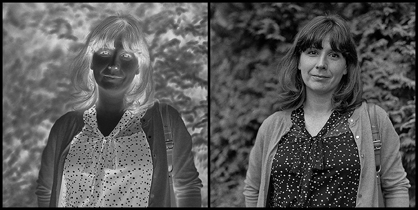

# negfix8

[negfix8](https://sites.google.com/site/negfix) created by
[JaZ99](http://www.flickr.com/people/jaz99). Thank you sir.

negfix8 can be used to automate the process of scanning negative film. Both
B&W negatives and color C-41 negatives are supported. A log curve is used for
inversion, so the outcome resembles the traditional print.



## Installation

negfix8 requires ImageMagick compiled with tiff support.

```bash
$ brew install libtiff
$ brew install imagemagick --with-libtiff
```

## Usage

### Scanning

negfix8 expects a tiff as input. For best results, scan your negative as a
positive with linear color channels (gamma = 1.0) and 16-bit color depth per
channel. If using SilverFast scanning software, you'll want to scan color as
48-bit HDR and B&W as 16-bit HDR.

No processing should be applied to the input, including sharpening. Be sure to
remove any fragments of the film holder from the scan. If scanning a color
negative, leave at least a 20 pixel border of the orange mask around the image.

### Processing

Pass any images you wish to process to negfix8. The results will be saved to
the same directory.

```bash
$ ./negfix8 scan.tif    # output saved as 'P_scan.tif'
```

You can supply a different output filename/type if you wish.

```bash
$ ./negfix8 scan.tif result.jpg
```

To quickly process a directory of images, use a loop.

```bash
for i in *.tif; do negfix8 "$i"; done
```

### Options

```
-cs   -- performs contrast stretch operation. It means that values in all color
         channels are spanning the most of 0 - 255 values. If you do not use
         this option, the scan may look flat, but do not worry, you can adjust
         the curves in the Photoshop/Lightroom/Gimp later on.

-s X  -- separates one color channel. Useful when scanning B&W negatives in
         color mode. Sometimes the scanner yields better quality in green or
         blue channel in color mode comparing to scanning in B&W mode. You can
         choose as an option the channel you want to separate to the output
         file.

-r X  -- sometimes the scanner produces better quality output when it is working
         in high resolution mode, but you do not need so huge positives. The -r
         options allows you to X-fold reduction (2-, 3- or 4-fold) of the input
         image by averaging adjacent pixels. For example, 3-fold reduction means
         that the output pixel is created from the average of 9 source pixels
         (in 3x3 square). It can be used to reduce digital noise of the scanner
         (it is similar to multi-sampling feature of some scanners).

-g X  -- you can specify the gamma of the image created.

-m    -- creates the mirror image (if you put the negative up side down on the
         scanner glass).
```
